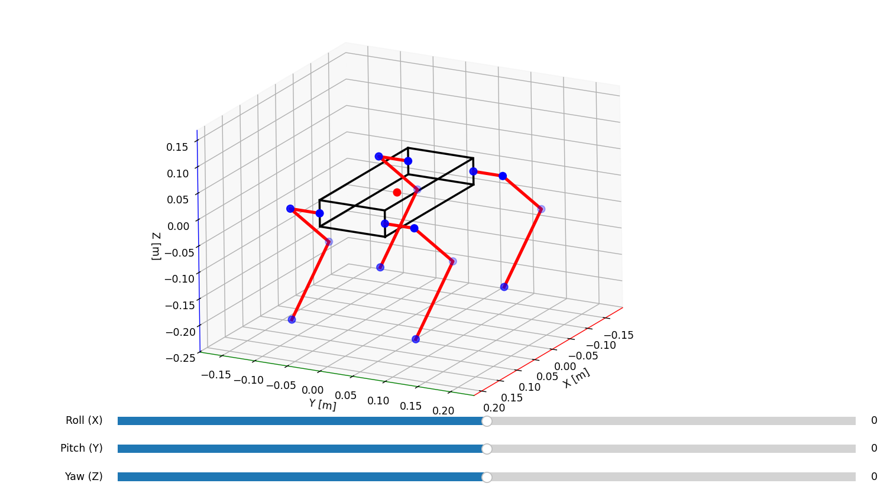

# Quadruped Robot - Inverse Kinematics

Python implementation of inverse kinematics for a quadruped robot.

The program calculates compensation for each leg to enable the robot to rotate by a defined angle around a chosen axis.

## GUI and visualization view

## Equations and Diagrams

We always calculate angles θ₂ and θ₃ by looking perpendicular to the leg. Therefore, we need to rotate our coordinate system by angle θ₁ to obtain this perpendicular view (see `quadruped_inverse.py`, line 114).
